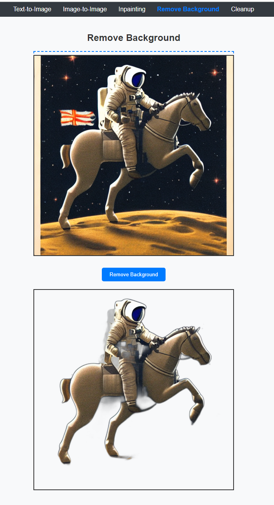

# AI 서버 테스트

## Text2Img


```
propmpt: a photograph of an astronaut riding a horse
```

## Img2Img


```
propmpt: this picture is a photograph of an astronaut riding a horse, photorealistic, ultra-detailed, high resolution, realistic textures, cinematic lighting, natural shadows, lifelike colors, realistic astronaut suit fabric, detailed horse fur and muscles, depth of field, sharp focus

parameter: {strength: 0.7}
```

## Inpainting


```
propmpt: replace the masked area with a realistic brown horse, ensuring the horse's fur is detailed and lifelike, with natural #964b00 tones and subtle variations in color. The horse should blend seamlessly into the existing environment, matching the lighting, shadows, and style of the original image. Make sure the horse's features, such as its mane and tail, are well-defined and consistent with the surrounding scene.
```

## rembg



## cleanup


## CLIP Intterogator


GPU 관련
```
NVIDIA Studio Driver 560.81
CUDA Version: 12.6
+-----------------------------------------------------------------------------------------+
| NVIDIA-SMI 560.81                 Driver Version: 560.81         CUDA Version: 12.6     |
|-----------------------------------------+------------------------+----------------------+
| GPU  Name                  Driver-Model | Bus-Id          Disp.A | Volatile Uncorr. ECC |
| Fan  Temp   Perf          Pwr:Usage/Cap |           Memory-Usage | GPU-Util  Compute M. |
|                                         |                        |               MIG M. |
|=========================================+========================+======================|
|   0  NVIDIA GeForce RTX 4050 ...  WDDM  |   00000000:01:00.0 Off |                  N/A |
| N/A   43C    P8              1W /   65W |      86MiB /   6141MiB |      0%      Default |
|                                         |                        |                  N/A |
+-----------------------------------------+------------------------+----------------------+

+-----------------------------------------------------------------------------------------+
| Processes:                                                                              |
|  GPU   GI   CI        PID   Type   Process name                              GPU Memory |
|        ID   ID                                                               Usage      |
|=========================================================================================|
|    0   N/A  N/A     29616      C   ...rograms\Python\Python310\python.exe      N/A      |
+-----------------------------------------------------------------------------------------+
```