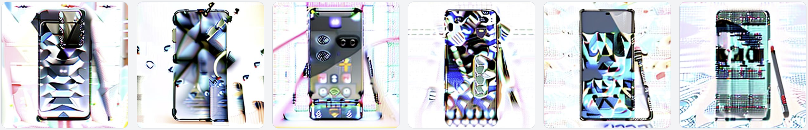

# Generation AI 모델 사용 및 라이브러리 선택

## 1. 개요

Defect Studio에 활용되는 AI와 관련된 정보를 기록하기 위한 문서입니다.

## 2. 기능

- 모델 동작은 주로 GPU 환경(VRAM 46GB)의 서버에서 동작하였습니다.
- 예시로 사용된 모델에 크기는 주로 3~6GB 사이이니 참고하시길 바랍니다.

### 2.1. Text-To-Image Model

- 기본 모델 정보 : [stable-diffusion-v1-4](CompVis/stable-diffusion-v1-4) / [stable-diffusion-v1-5](https://huggingface.co/stable-diffusion-v1-5/stable-diffusion-v1-5) / [stable-diffusion-2](https://huggingface.co/stabilityai/stable-diffusion-2)

- 예시 사진
  - stable-diffusion-v1-4
    
  - stable-diffusion-v1-5
    
  - stable-diffusion-v2[DPM++ 2M]
    
  - stable-diffusion-v2[Euler a]
    

- 결론 : 적은 프롬프트로 나타내는 이미지는 `version1.x`에서 더 잘 나오는 것을 확인했지만, 프롬프트가 커질수록 `version2`에서도 좋은 퀄리티가 나오는 것을 확인했습니다.

### 2.2. Image-To-Image Model

- 기본 모델 정보 : [stable-diffusion-v1-4](CompVis/stable-diffusion-v1-4) / [stable-diffusion-v1-5](https://huggingface.co/stable-diffusion-v1-5/stable-diffusion-v1-5) / [stable-diffusion-2](https://huggingface.co/stabilityai/stable-diffusion-2)

- 원본 사진
  

- 예시 사진
  - stable-diffusion-v1-4
    
  - stable-diffusion-v1-5
    
  - stable-diffusion-2
    
- 결론 : 텍스트와 마찬가지로 `v1.x`가 주로 적은 프롬프트로 좋은 결과물을 만드는 것을 알 수 있었습니다.


### 2.3. Inpainting Model

- 기본 모델 정보 : [stable-diffusion-2-inpainting](https://huggingface.co/stabilityai/stable-diffusion-2-inpainting)

- 예시 사진
 

- 결론 : 인페인팅 영역에 이미지를 만드는 것은 잘 동작하지만, 이를 잘 활용하는 것은 사용자 역량에 많이 달려있는 듯 합니다. 또한 큰 영역을 지정할 수록 퀄리티가 아쉽기도했습니다.

### 2.4. Remove Background

- 사용 모델 : [briaai/RMBG-1.4](https://huggingface.co/briaai/RMBG-1.4)

- 예시 사진
  

- 사용성 비교(성능 지표 요약)
  |   | briaai/RMBG-1.4 | rembg |
  |---------------|---------------|---------------|
  | GPU 사용량 비교 | 중간 0.9GB | CPU 사용 |
  | 속도 비교 | 빠름 600ms | 중간 1100ms |
  | 성능      |    상  |    중상     |

  위와 같은 성능 지표를 기준으로 `briaai/RMBG-1.4` 선택
- 관련 문서
   - [briaai/RMBG-1.4 평가](../rembg/rembg_model_RMBG-1.4.md)
   - [rembg 평가](../rembg/rembg_model_rembg-lib.md)

### 2.5. Cleanup

- 사용 모델 : [IOPaint](https://github.com/Sanster/IOPaint)

- 예시 사진
  

- 사용성 비교
  |   | Inpainting | IOPaint |
  |---------------|---------------|---------------|
  | GPU 사용량 비교 | 매우 많음 3.4GB | 적음 0.3~0.6GB (이미지 수에 따라 batch size 조정) |
  | 속도 비교 | 느림 24000ms | 빠름 1900ms |
  | 성능      |    중  |    중     |

- 관련 문서
   - [Inpainting 평가](../cleanup/cleanup_model_inpainting.md)
   - [IOPaint 평가](../cleanup/cleanup_model_iopaint.md)

### 2.6. CLIPItterogate

- 사용 모델 : [ViT-L-14/openai]()


### 2.7. DreamBooth

- [diffusers](https://github.com/huggingface/diffusers)에 있는 [train_dreambooth.py](https://github.com/huggingface/diffusers/blob/main/examples/dreambooth/train_dreambooth.py) 활용 API 구현
- multi_concept, inpainting 특화 컨셉 구현

## 3. Train Example

### 3.1. 이미지 학습 시나리오

1. 데이터 셋 준비
    - [MVTec Anomaly Detection Dataset](https://www.mvtec.com/company/research/datasets/mvtec-ad) 

2. category 별 분류 및 학습 데이터 준비
    ```json
    [
        {
            "instance_prompt": "a photo of a broken teeth zipper",
            "class_prompt": "a photo of a zipper",
            "instance_data_dir": "/path/to/instance_dir",
            "class_data_dir": "/path/to/class_dir"
        },
        {
            "instance_prompt": "a photo of a combined zipper",
            "class_prompt": "a photo of a zipper",
            "instance_data_dir": "/path/to/instance_dir",
            "class_data_dir": "/path/to/class_dir"
        }
    ]
    ```

3. `accelerate` 라이브러리 활용 [train_multi_subject_dreambooth_inpaint.py](https://github.com/Kimbumsoo99/diffusers-fork-defectStudio/blob/defect-studio/defect/train_multi_subject_dreambooth_inpaint.py) 실행

4. 결과 분석 및 보고서 작성

### 3.2. Model Management

- 폴더 내 파일 구조
- matplot 그래프


### 3.3. Generation Examples


### 3.4. Compare

- No 학습

- 일반 학습 결과

- inpainting 학습 결과


### 3.5. 결론


표 형태로, 멀티콘셉 지원여부, inpainting 지원 여부

|   | No | Nomal | Defect-Studio |
|---------------|---------------|---------------|---------------|
| Multi-Concept 지원 여부 | X | O | O |
| Inpainting 지원 여부 | X | X | O |
| 예시 (Example)      |       |         |  |