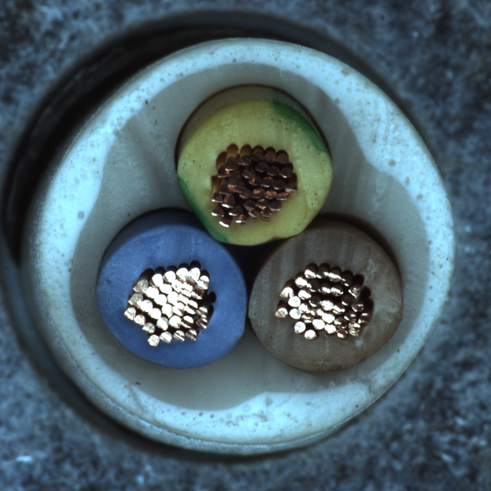

# Background Removal AI Model Test Document
## 1. 개요
### 1.1 테스트 목적
본 테스트의 목적은 briaai/RMBG-1.4 AI 모델의 성능, 정확도 및 추론 가용성을 평가하는 것입니다.

### 1.2 테스트 대상 모델
- 모델명: **briaai/RMBG-1.4**
- 레퍼런스: [huggingface link](https://huggingface.co/briaai/RMBG-1.4) / [github](https://github.com/chenxwh/cog-RMBG)
- 모델 유형: `IS-Net`

## 2. 테스트 환경
### 2.1 하드웨어 (ex.)
- CPU: Intel(R) Core(TM) Ultra 7 155H 3.80 GHz
- GPU: NVIDIA GeForce RTX 4050 Laptop GPU (6GB)
- RAM: 32GB

### 2.2 소프트웨어
- OS: Windows 10
- Python 버전: 3.10.6
- 딥러닝 프레임워크: `torch 2.0.1+cu117`


### 2.3 테스트 데이터셋
- 데이터셋 구성: 

| 카테고리 (Category) | bottle | cable| capsule | hazelnut | metal_nut | pill | screw |
|---------------|---------------|---------------|---------------|---------------|---------------|---------------|---------------|
| 이미지 수 (Image Num)      |      10장   |    10장     |  10장 |     10장     |      10장     |     10장      |    10장     |
| 설명 (Description)      |      Object 한 개 존재하는 유사한 사진 모음, 흰색 배경   |    Object 한 개 존재하는 유사한 사진 모음, 컬러 배경     |  Object 한 개 존재하는 유사한 사진 모음, 흰색 배경 |     Object 한 개 존재하는 유사한 사진 모음, 검은색 배경, 방향 다름     |      Object 한 개 존재하는 유사한 사진 모음, 검은색 배경, 방향 다름     |     Object 한 개 존재하는 유사한 사진 모음, 검은색 배경      |    Object 한 개 존재하는 유사한 사진 모음, 흰색 배경     |
| 예시 (Example)      |       |         |           |           |           |         |     |
   - 데이터셋 구성 현황
- 이미지 수: 70장
- 해상도: 다양 (최소 700x700, 최대 1024x1024)
- 구성: MVTec-AD 100%, VISION-DATASETS 30%

## 3. 평가 지표
1. 정확도
   - MAE (Mean Absolute Error) (L1 metric)
   - Max F-Measure
2. 처리 속도
   - FPS (Frames Per Second)
3. 메모리 사용량
   - 최대 GPU 메모리 사용량 (MB)

## 4. 테스트 시나리오
### 4.1 정량평가 (Quantitative Evaluation)
#### 4.1.1 MAE/F-Measure
| 수량(Quantity) | MAE | F-Measure(F1 Score) |
|---------------|---------------|---------------|
|      1장          |     0.14 ~ 9.32       |    0.36 ~ 0.99 |
|      10장         |     0.17 ~ 4.90      |    0.49 ~ 0.99   |
|      70장         |        1.48       |      0.90        |

#### 4.1.2 Speed/GPU Usage 평가
| 표본 | 처리 시간 (ms) | GPU 메모리 (MB) |
|---------------|---------------|----------------|
|      1장         |      600ms      |     968MB        |
|      10장         |     5000ms       |      968MB     |
|      70장         |     45310ms       |      968MB      |

### 4.2 정성평가 (Qualitative Evaluation)
> 각 카테고리 별로 특징 나열 후 사진 평가를 진행합니다. 사용된 카테고리는 배경을 기반으로 하였습니다.
각각의 사진 평가는 주관적인 평가로 6명의 팀원이서 `상, 중, 하`를 통해 평가 점수를 작성했습니다.


관련하여 평가에 사용된 사진은 하단 데이터 셋에 추가하겠습니다.
참고로 모든 데이터셋은 하나의 Object만 존재합니다.

| 카테고리(배경 색상) | 수량 | 사진 출력 제대로 됐는지 |
|---------------|---------------|---------------|
|      흰색      |   30장  |    성공적인 작업 (100%)      |
|      검은색         | 30장 |    성공적인 작업 (100%)        |
|      컬러         |  10장  |   불안정한 작업 포함 (80%)    |


### 4.4 이미지 크기 및 해상도 테스트
- 최소 700x700, 최대 1024x1024

## 5. 테스트 절차
1. 테스트 환경 설정

2. 모델 로드

   ```python
   from transformers import pipeline

   rmbg_pipeline = pipeline("image-segmentation", model="briaai/RMBG-1.4", trust_remote_code=True, device=device)

   output_image = rmbg_pipeline(input_image)
   ```

3. 테스트 데이터셋 준비
  
    - [MVTec Anomaly Detection Dataset](https://www.mvtec.com/company/research/datasets/mvtec-ad) 
  
    - [VISION-Workshop/VISION-Datasets](https://huggingface.co/datasets/VISION-Workshop/VISION-Datasets)

4. 각 테스트 시나리오 실행
    
    a. 원본 이미지 라벨링을 통한 MASK 영역 지정 (흰, 검 하나의 채널)
      - 라벨은 [X-AnyLabeling](https://github.com/CVHub520/X-AnyLabeling)을 사용하였으며 `Segment Anything (ViT-Base Quant)` Model을 활용하였습니다. 
      - 각각의 Mask 사진을 통해 원본 이미지를 추출하였습니다.

    b. 이미지 로드 / 배경 제거 수행
      - 원본 이미지를 테스트 모델을 통해 이미지 생성
      - 관련 스크립트 포함
    
    c. 결과 저장 및 메트릭 계산
      - 생성된 두 개의 데이터셋을 비교

5. 결과 분석 및 보고서 작성

## 6. 결과 기록 및 분석 방법
### 6.1 결과 기록 템플릿
- 이미지 일부 발췌


## 7. 성능 기준 (Acceptance Criteria)
- MAE: ≤ 10
- 평균 F1 Score: ≥ 0.90
- 평균 처리 시간: ≤ 1000ms (512x512 해상도 기준)
- 최대 GPU 메모리 사용량: ≤ 3GB

## 8. 버그 보고 및 추적 프로세스
1. 버그 발견 시 즉시 Jira 티켓 생성
2. 버그 재현 단계 상세히 기록
3. 버그의 심각도 및 우선순위 설정
4. 개발팀에 할당 및 해결 과정 추적
5. 해결된 버그에 대한 재테스트 수행

## 9. 테스트 결과 요약

- 원본 이미지 결과


- 이미지 실습 결과 


## 10. 결론

전체 총 이미지 70장에 대하여 준수한 결과를 나타내고 있으며, 프로젝트 성능 기준에 적합하여 도입을 고려해도 되는 단계입니다.
